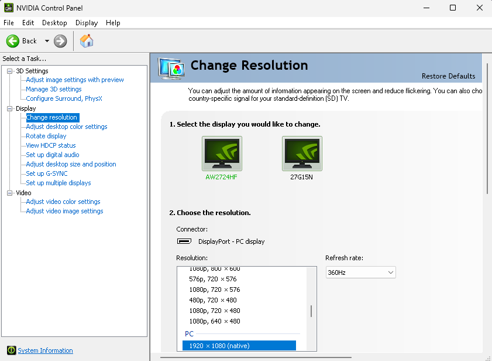
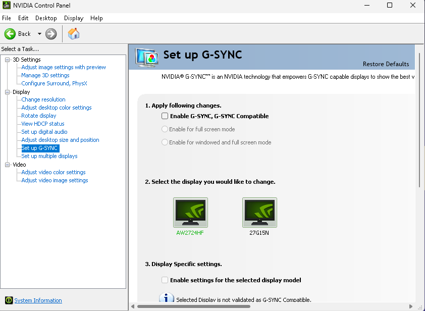
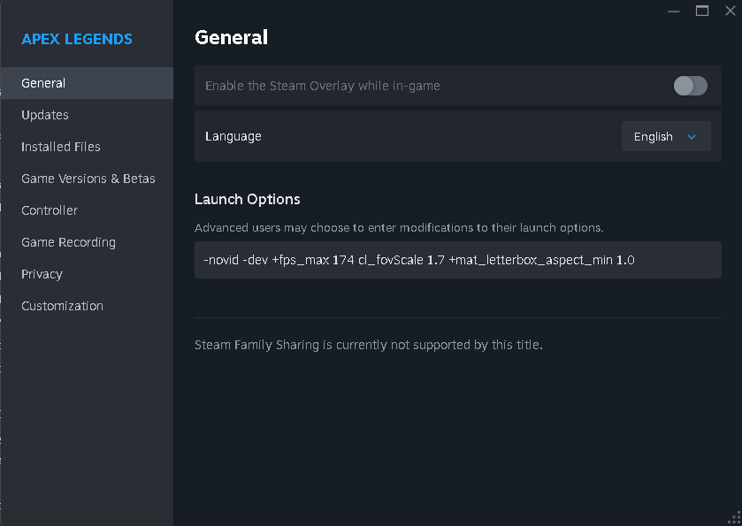
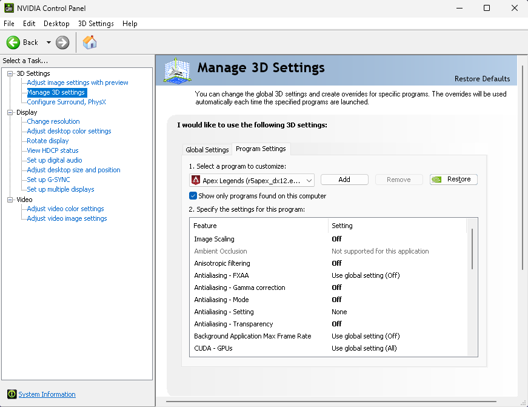
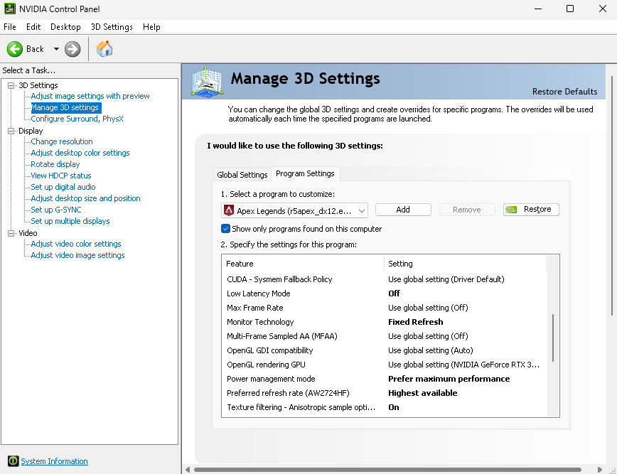
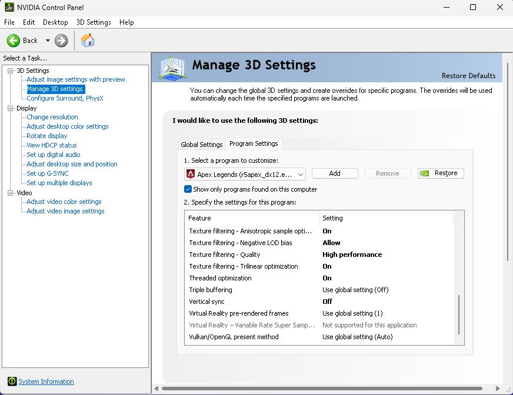
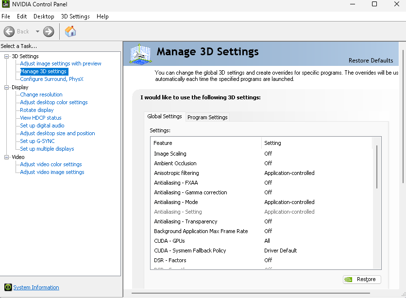
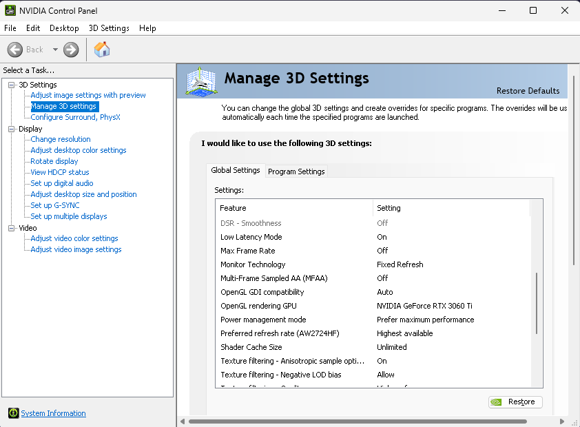
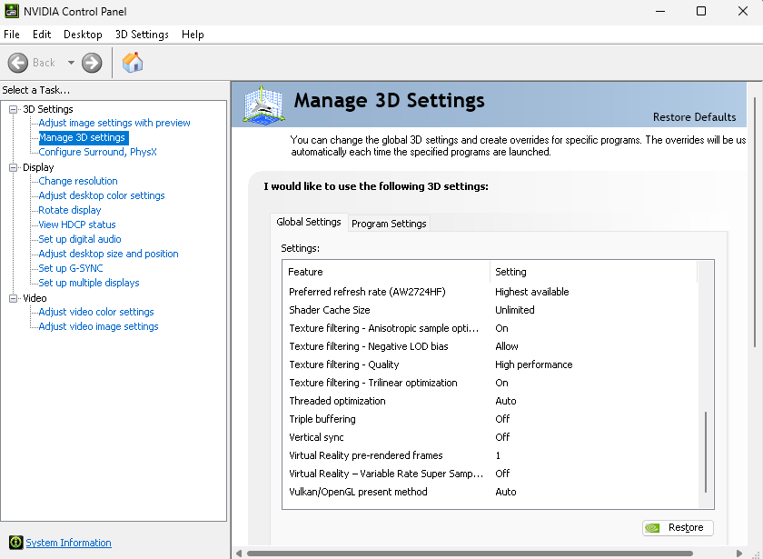

> ⚠️ **Use at your own risk:** Back up your files first. Change one thing at a time and undo anything that causes problems. FPS gains and command support are not guaranteed.

<a id="apex-legends-settings"></a>

<h1 align="center">Apex Legends settings</h1>
<p align="center"><strong>More FPS. Less input delay. Smoother fights.</strong><br/>Start with the basics. Open the extra steps only when you need them.</p>

<p align="center">
  <a href="#quick-setup"><strong>Quick start</strong></a> &middot;
  <a href="#downloads"><strong>Downloads</strong></a> &middot;
  <a href="#nvidia-settings"><strong>NVIDIA table</strong></a> &middot;
  <a href="#contents"><strong>Guides</strong></a> &middot;
  <a href="#notes"><strong>Notes</strong></a> &middot;
  <a href="#references"><strong>References</strong></a>
</p>

<table>
<tr>
<td align="center" width="33%"><strong>🖥️ Check your monitor</strong><br/><sub>Make sure the screen is actually using its high refresh rate.</sub><br/><a href="#refresh-rate">Check your Hz</a></td>
<td align="center" width="33%"><strong>🎮 Tune the game</strong><br/><sub>Choose graphics settings and an FPS cap your PC can hold.</sub><br/><a href="#in-game">Game settings</a></td>
<td align="center" width="33%"><strong>📊 Check the difference</strong><br/><sub>Compare real fights, not just a high number in the firing range.</sub><br/><a href="#validation">Test a change</a></td>
</tr>
</table>

Start with the screen and the game settings. You can do both without touching a config file. The extra guides are below—**click a section to expand it** when you need the steps.

<a id="quick-setup"></a>

## Start here — check the basics first

**Check your monitor's Hz before downloading anything.** A 144, 240, or 360 Hz monitor can still be running at 60 Hz if it hasn't been set up. Buying a faster screen doesn't mean Windows has selected the right refresh rate.

1. **Check the refresh rate.** Right-click the desktop → **Display settings → Advanced display**. Select the monitor you play on and its highest supported refresh rate at your intended resolution. [NVIDIA steps](#refresh-rate).
2. **Check what's in your PC.** Press **Ctrl + Shift + Esc → Performance**. Click **CPU**, **Memory**, and **GPU** to find their names and memory sizes. [What to write down and what to choose](#hardware).
3. **Set up the game and FPS cap.** Take screenshots of your current settings. Start with the [in-game settings](#in-game), then use the [hardware guide](#hardware) to pick a target your PC can hold. Check whether G-SYNC/FreeSync is enabled before following the [cap instructions](#nvidia).
4. **Play a few fights.** Watch for repeated FPS drops, stutters, and how aiming feels. If a change makes it worse, put it back. A high firing-range number isn't the target.
5. **File edits are optional.** Close Apex and back up the originals before trying a snippet. Once the graphics settings are finished, you can set **only `videoconfig.txt` to read-only**. Leave **`settings.cfg` and `profile.cfg` writable**, so volume, binds, and other preferences can save. [Read-only steps](#read-only).

**Example: where to check your monitor's Hz in NVIDIA Control Panel.** This screen is set to 360 Hz at 1920 × 1080. Choose the resolution and refresh rate your own monitor supports.



## Downloads

> [!IMPORTANT]
> `settings.cfg`, `profile.cfg`, and `videoconfig.txt` are **snippets, not full replacements**. Back up the files Apex created and edit only matching lines. Keep your own binds, sensitivity, and resolution.

| File | What it's for | Copy / download |
| --- | --- | --- |
| [settings.cfg](settings.cfg) | Mouse-acceleration preference | [Raw file](https://raw.githubusercontent.com/WR3K/apex-legends-settings/main/settings.cfg) |
| [videoconfig.txt](videoconfig.txt) | A few graphics settings | [Raw file](https://raw.githubusercontent.com/WR3K/apex-legends-settings/main/videoconfig.txt) |
| [profile.cfg](profile.cfg) | ADS blur preference | [Raw file](https://raw.githubusercontent.com/WR3K/apex-legends-settings/main/profile.cfg) |

These three downloads contain suggested settings, not complete replacement files. They haven't been tested in a running Apex client for this guide.

<a id="file-locations"></a>

<details>
<summary><strong>📂 Where does each file go?</strong></summary>

| File | Exact destination |
| --- | --- |
| `settings.cfg` | `%USERPROFILE%\Saved Games\Respawn\Apex\local\settings.cfg` |
| `videoconfig.txt` | `%USERPROFILE%\Saved Games\Respawn\Apex\local\videoconfig.txt` |
| `profile.cfg` | `%USERPROFILE%\Saved Games\Respawn\Apex\profile\profile.cfg` |

The Saved Games paths can be pasted into **Windows + R**. If that folder was moved, use `shell:SavedGames` and look for `Respawn\Apex` instead.

All three downloads are snippets to merge into the files Apex creates in Saved Games, not complete files to copy over them. `profile.cfg` is an Apex file, not an NVIDIA driver profile.

Need the full walkthrough? Open [Finding files, Notepad, and read-only](#beginners).

</details>

<a id="contents"></a>

## Guides

**Open the section you need.** The detailed instructions stay folded away until you click them.

[Monitor Hz](#refresh-rate) · [Read-only](#read-only) · [Steam launch options](#steam) · [NVIDIA settings table and screenshots](#nvidia-settings) · [Find your specs / choose settings](#hardware)


### 🖥️ Start with the monitor

<a id="refresh-rate"></a>

<details>
<summary><strong>Is your monitor actually running at 144 / 240 / 360 Hz?</strong></summary>

**Hz is how often the screen refreshes each second. FPS is how many frames the game produces.** They are different: a 360 Hz screen doesn't make the PC render 360 FPS. Still, check that you're using the refresh rate the screen supports before spending time on other tweaks.

### Windows: works regardless of GPU brand

1. Right-click an empty area of the desktop → **Display settings**.
2. Open **Advanced display** (called **Advanced display settings** on some Windows versions).
3. If you have more than one screen, select the one you use for Apex.
4. Find **Choose a refresh rate** or **Refresh rate** and select the highest supported rate at the resolution you intend to use. Check that the resolution stays as intended.
5. Confirm **Keep changes** if asked, then check the displayed refresh rate again.

If the screen goes blank, wait for the change to revert. Don't confirm a mode the monitor cannot display correctly.

### NVIDIA: the Change resolution page

1. Open **NVIDIA Control Panel → Display → Change resolution**.
2. Select the gaming monitor at the top—don't accidentally change the second screen.
3. Select its native resolution. If it appears under **PC** in the resolution list, use that entry; TV-mode entries can offer a different set of refresh rates.
4. In the **Refresh rate** dropdown beside the resolution list, choose the intended supported rate, then click **Apply** and confirm.
5. Check Windows Advanced display afterward to confirm the setting.

**Example screenshot settings:** an Alienware AW2724HF is selected, with **1920 × 1080 (native)** under **PC** and **360 Hz** in the refresh-rate dropdown. Those values belong to that example display; select the correct ones for yours.

### The refresh rate you expected isn't listed?

- Double-check the selected screen and resolution.
- Check the monitor manual for the connection needed at that resolution and refresh rate. The monitor port, GPU port, cable, and any dock/adapter all matter. Try a direct connection with a suitable cable.
- Some monitors need a high-refresh option enabled in their own on-screen menu. Follow the manufacturer's instructions for that model.
- If NVIDIA Control Panel has no **Display** section, the screen may be controlled by integrated graphics, especially on a laptop. Use Windows Advanced display or the graphics software that controls that screen.

Don't create a custom resolution or overclock the display just to make it match an example.

### Check G-SYNC separately

In **NVIDIA Control Panel → Display → Set up G-SYNC**, select the gaming monitor and look at **Enable G-SYNC, G-SYNC Compatible**. The example screenshot has this box **unticked**. That shows the example uses G-SYNC off; it is not an instruction for everyone to disable it.



A missing, greyed-out, or “not validated” option doesn't prove G-SYNC is working. Check the monitor's support, its Adaptive-Sync setting, and the connection. If the panel asks for the monitor to be the primary display, check that selection too. Use the [G-SYNC/V-Sync guide](#nvidia) to choose the setup you want.

The **Preferred refresh rate → Highest available** option in the Apex program profile is not a substitute for checking these display settings.

[Back to guides](#contents)

</details>

### 📁 Install and edit files

<a id="beginners"></a>

<details>
<summary><strong>Finding files, opening Notepad, and setting read-only</strong></summary>

A config file is just a text file with settings in it. You can open it in Notepad. The important part is putting it in the right folder and keeping a backup before editing anything.

### What the terms mean

| Term | Plain meaning |
| --- | --- |
| FPS | Frames the game produces each second; higher is useful when frames arrive consistently |
| Hz | How often your monitor refreshes each second; a 360 Hz screen does not make the PC render 360 FPS |
| Frame time | Time taken to produce a frame; sudden spikes feel like stutter |
| FPS cap | A limit on how many frames the game tries to produce, such as `+fps_max 174`; your PC can still drop below it |
| Latency | Delay between an action and its visible result; network ping is a separate contributor to online responsiveness |
| 1% low | A tool-dependent summary of the slowest frames; compare results using the same tool |
| VRAM / RAM | GPU memory for graphics / system memory; 32 GB RAM does not mean 32 GB VRAM |
| G-SYNC / FreeSync | Features that let a compatible monitor adjust refresh timing to frame delivery; collectively called variable refresh rate (VRR) |
| V-Sync | Controls frame presentation to prevent tearing; its latency tradeoff depends on the setup |
| Reflex | NVIDIA's supported in-game feature for reducing rendering-related latency |
| `.cfg` file | A text file containing settings; edit the existing file in Notepad and preserve its filename |
| Video config | The game's saved graphics settings, stored separately from its installed files |
| DoF / ADS | Depth of field (focus blur) / aiming down sights |

### Download this repository

On this repository's GitHub page, choose **Code → Download ZIP**. In File Explorer, right-click the downloaded ZIP → **Extract All**. Open the extracted folder. For one file, open it on GitHub and use **Download raw file**. If you save the normal webpage instead, you may download the webpage rather than the config.

### Show filename extensions

Open File Explorer with **Windows + E**. On Windows 11 choose **View → Show → File name extensions**; on Windows 10 use **View → File name extensions**. This lets you distinguish `settings.cfg` from the incorrect `settings.cfg.txt`.

### Find your saved video settings

1. Run Apex once, apply your preferred resolution, then close it normally.
2. Press **Windows + R** to open Run.
3. Paste the following path, including the percent signs, and press **Enter**:

```text
%USERPROFILE%\Saved Games\Respawn\Apex\local
```

4. Find `videoconfig.txt`. `%USERPROFILE%` expands to your Windows user folder; you do not need to type your username.
5. If the folder is missing, use **Windows + R → `shell:SavedGames`** and look for **Respawn → Apex → local**. Saved Games may have been relocated. Confirm you have launched Apex under this Windows account.

There are two destination folders: Saved Games `local` holds settings/video config, and Saved Games `profile` holds profile.cfg. See the [destination table](#downloads).

### Back up and open files in Notepad

1. Close Apex. Copy each original file to a separate backup folder, such as `Documents\Apex-settings-backup`. Keep a screenshot or text copy of your existing launch options too.
2. Right-click the file → **Open with → Notepad**. Windows 11 may show **Show more options**, **Edit in Notepad**, or **Choose another app** first.
3. Edit only the intended lines. Preserve quotation marks and braces. Lines beginning with `//` in the snippets are comments explaining the settings.
4. Press **Ctrl + S**. If saving fails, check the file's [read-only attribute](#read-only); don't change folder permissions blindly.
5. Edit the existing game-generated file rather than creating a replacement. If using **Save As**, choose **All files** and keep the original filename and extension. Verify it in File Explorer afterward.

Keep your original files and edit only the matching lines. Don't overwrite your binds or personal preferences. For video settings, follow the [merge guide](#video-config): the repository's `videoconfig.txt` is deliberately incomplete and must not replace your full file.

For optional protection of the saved graphics settings, see [Read-only: videoconfig.txt only](#read-only).

Continue with [in-game settings](#in-game), [choosing settings for your PC](#hardware), and [validation](#validation).

[Back to guides](#contents)

</details>

<a id="read-only"></a>

<details>
<summary><strong>Read-only: videoconfig.txt only — keep volume and binds editable</strong></summary>

Read-only tells Windows that a file shouldn't be written over. For this guide, use it **only on `videoconfig.txt`**, and only if you want to keep the graphics settings you've finished testing. It is optional and doesn't increase FPS.

| File | Read-only? | Why |
| --- | --- | --- |
| `videoconfig.txt` | Optional, after finishing graphics changes | Helps protect the saved graphics values |
| `settings.cfg` | Leave unticked | Let binds, input settings, and other saved preferences update |
| `profile.cfg` | Leave unticked | Let preferences such as volume and gameplay settings save normally |

### How to set it

1. Finish changing graphics in Apex, click **Apply**, and exit the game normally. Back up the saved file before any manual edits.
2. If using the video snippet, edit the matching lines in your existing file and save in Notepad. Close it afterward.
3. Press **Windows + R**, paste `%USERPROFILE%\Saved Games\Respawn\Apex\local`, and press Enter.
4. Right-click **videoconfig.txt → Properties → General**.
5. Under **Attributes**, tick **Read-only**, then click **Apply → OK**.

Use the checkbox on the actual file, not the folder. If Windows hides extensions, it may show just `videoconfig`; **Type of file** should say **TXT File (.txt)**. Turn on filename extensions using the [beginner steps](#beginners) if unsure.

### What if you change graphics in game afterward?

**Read-only protects the saved file, not the running game.** Pressing Apply can still change how the current session looks. The game may be unable to save those changes to the protected file, so they may revert after restarting. Other saved settings or cloud sync can also affect what loads—check the result rather than assuming it stayed fixed.

To keep a new graphics change: close Apex, untick **Read-only → Apply → OK**, change the settings, then exit normally so they save. Check the saved result before ticking it again. Leave it off while troubleshooting or letting a game update rewrite the file.

If volume or binds keep reverting, check that **settings.cfg and profile.cfg are not read-only**. Keeping them writable avoids blocking those preference changes. The ADS blur edit doesn't require locking the whole profile file.

[Back to guides](#contents)

</details>

<a id="saved-configs"></a>

<details>
<summary><strong>Editing settings.cfg and profile.cfg</strong></summary>

These are files Apex saves for you. You don't need to add launch options to load them.

First, run the game, save your preferences, and close it normally. Press **Windows + R**, paste one of the folder paths below, and press Enter.

| Folder to open | File to edit | What to change |
| --- | --- | --- |
| `%USERPROFILE%\Saved Games\Respawn\Apex\local` | `settings.cfg` | If `m_acceleration` already exists, you can set it to `"0"` to request no mouse acceleration. Leave your binds, sensitivity, ADS multipliers, and other lines alone |
| `%USERPROFILE%\Saved Games\Respawn\Apex\profile` | `profile.cfg` | Find `hud_setting_adsDof` and, if it exists, set it to `"0"`. This requests no depth-of-field blur while aiming down sights |

Back up the file before editing. Use [Open with → Notepad](#beginners), change the existing value, and save. Don't add a second copy of the same line or replace your complete file with the short download.

For the ADS setting, restart Apex and compare the same weapon, optic, and scene. Some blur may remain, and the setting may be ignored on a particular game version. Judge it by what actually changes on screen.

### Can't find the file or setting?

Check that you've launched Apex using this Windows account. If Saved Games was moved, press **Windows + R** and enter `shell:SavedGames`, then look for `Respawn\Apex`.

If the game hasn't created a particular key, skip it. Don't create a full settings file from the snippet or assume pasting the line somewhere else will make it work. The file locations and example keys also appear in an [older community reference](#ref-apexconfigs); the files your installed game creates are what you should work from.

Leave **settings.cfg and profile.cfg writable** so volume, binds, and other preferences can save. If using read-only at all, [use it only for videoconfig.txt](#read-only). The mouse-acceleration line is a preference, not a proven latency fix. These snippets haven't been tested in a running client for this guide.

[Back to guides](#contents)

</details>

<a id="video-config"></a>

<details>
<summary><strong>Editing videoconfig.txt</strong></summary>

Start with the in-game graphics menu. It writes the settings in the format your current Apex version expects. Editing `videoconfig.txt` is optional.

The [download](videoconfig.txt) contains only four suggested settings. **Don't replace your complete video config with it.**

1. Apply the [in-game settings](#in-game), then close Apex.
2. Press **Windows + R**, paste `%USERPROFILE%\Saved Games\Respawn\Apex\local`, and open it. Back up `videoconfig.txt`.
3. Open your original in Notepad. Find the matching keys from the table below and change their values. If a key isn't there, skip it and use the game menu.
4. Keep the existing `VideoConfig` block and braces. Don't add a second block or duplicate keys.
5. Leave your resolution, display mode, texture memory budget (`setting.stream_memory`), version (`setting.configversion`), and all other values as they are.
6. Save, restart Apex, and check the menu and a short match. Exit normally and look at what the game saved afterward.

| Key | Value in the snippet | Intended change |
| --- | --- | --- |
| `setting.mat_vsync_mode` | `0` | In-game V-Sync off; driver V-Sync depends on the [setup you choose](#nvidia) |
| `setting.mat_antialias_mode` | `0` | Anti-aliasing off |
| `setting.volumetric_lighting` | `0` | Volumetric lighting off |
| `setting.particle_cpu_level` | `0` | Low effects detail |

These mappings come from the reference config and still need checking in the current game. If a value keeps changing back, it may have changed meaning or stopped being supported. Read-only won't fix that.

Once you're happy with the settings, you can use the [read-only steps for videoconfig.txt](#read-only). Leave the file writable while testing and when a game update needs to update its format. Keep settings.cfg and profile.cfg writable. The ADS blur line belongs in the [profile snippet](#saved-configs), not this file.

[Back to guides](#contents)

</details>

<a id="steam"></a>

<details>
<summary><strong>Steam launch options</strong></summary>

In Steam, right-click **Apex Legends → Properties → General**. Find **Launch Options** and save a copy of anything already in the box.

### Adding an FPS cap

`+fps_max` sets the highest FPS the game should try to render. It doesn't guarantee the PC can hold that number.

For the example 174 FPS setup:

```text
+fps_max 174
```

Replace 174 with the target you chose in the [FPS-cap guide](#nvidia). For example, 141 FPS is one starting point for a 144 Hz screen with G-SYNC enabled and driver V-Sync on. It isn't the right cap for every PC.

Keep the driver's Max Frame Rate setting off when using this cap. Setting the cap in one place makes troubleshooting easier.

### Example launch options shown in the screenshot



The screenshot shows this line exactly:

```text
-novid -dev +fps_max 174 cl_fovScale 1.7 +mat_letterbox_aspect_min 1.0
```

**You don't need all of these to follow the guide.** Start with `+fps_max 174`, replacing 174 with your chosen cap. Here's what the other parts are for:

| Option shown | What to know |
| --- | --- |
| `+fps_max 174` | Requests a 174 FPS cap. Check the FPS display in game to see whether the PC holds it. |
| `-novid` | Intended to skip the intro video. Optional; remove it if ignored. It doesn't raise FPS during a match. |
| `-dev` | An older developer-mode option often listed for skipping intros. Current intro-skipping support is unverified; leave it out of the starting setup. |
| `cl_fovScale 1.7` | A field-of-view setting. As written, it lacks the `+` normally used to pass a console variable at startup, so don't assume it applies. Use Apex's FOV slider instead. |
| `+mat_letterbox_aspect_min 1.0` | A legacy aspect-ratio / letterboxing override. Its effect in the current client is unverified; leave it out when starting at native resolution. |

The screenshot records an example setup; it doesn't prove every option works. The Reddit comments suggest trying `-novid` instead of `-dev` for intro skipping. Keep whichever optional changes you can actually confirm in your game.

[Back to guides](#contents)

</details>

<a id="ea-app"></a>

<details>
<summary><strong>EA app launch options</strong></summary>

Open Apex's game properties/manage menu in the EA app. Find **Advanced launch options** or the similarly named field and save a copy of the existing arguments.

To set an example 174 FPS cap, enter:

```text
+fps_max 174
```

Choose your own cap using the [FPS-cap guide](#nvidia). Keep the driver's Max Frame Rate setting off when using the game cap.

You can also try `-novid` for intro skipping, as reported in the Reddit comments. It's optional, isn't verified here, and doesn't improve in-match FPS. EA app menu names can change between versions.

[Back to guides](#contents)

</details>

### 🎮 Game and PC settings

<a id="in-game"></a>

<details>
<summary><strong>In-game settings: where to start</strong></summary>

Open Apex's video settings and use this as a starting point. Menu names can change after updates. Start at your monitor's native resolution—the resolution it was designed to display—and lower it if the graphics card can't keep up.

| Setting | Starting point | Tradeoff or check |
| --- | --- | --- |
| Display mode | Fullscreen | Compare borderless if needed; measure on your system |
| Aspect ratio / resolution | Native | Reduced resolution helps mainly when GPU limited |
| FOV | Keep your accustomed value | Higher FOV can increase rendering load; 110 is not mandatory |
| FOV ability scaling | Disabled | Stable perceived zoom |
| Sprint view shake | Minimal | Less camera movement |
| V-Sync | Disabled in game | See driver profiles for tear-free play |
| NVIDIA Reflex | Enabled, if supported | Compare Enabled + Boost; extra power/heat may not improve results |
| Adaptive resolution FPS target | 0 | Consistent resolution; dynamic resolution is an optional GPU-limited tradeoff |
| Adaptive supersampling | Disabled | Avoid extra rendering load |
| Anti-aliasing | None initially | TSAA may look smoother but softer; compare motion clarity |
| Texture streaming budget | Try 4 GB on an 8 GB graphics card | For other cards, use the [VRAM table](#texture-budget). Lower one step if stuttering gets worse |
| Texture filtering | Bilinear initially | Compare 4×/8× for sharper surfaces and measured cost |
| Ambient occlusion | Disabled | Less shading cost |
| Sun shadow coverage / detail | Low | Lower shadow cost |
| Spot shadow detail | Disabled | Lower shadow cost |
| Volumetric lighting | Disabled | Lower lighting cost |
| Dynamic spot shadows | Disabled | Lower shadow cost |
| Model / map / effects detail | Low, where available | Compare clarity and frame times |
| Impact marks | Disabled | Less persistent clutter |
| Ragdolls | Low | Less physics/detail work |

Keep the sensitivity, aim settings, keybinds, audio setup, and gameplay preferences you're comfortable with. Start with 1000 Hz mouse polling if supported; higher rates can increase CPU load. Mouse polling does not prescribe a texture streaming budget. Use the game's performance display to monitor FPS and network behavior, but do not equate ping with input latency.

The [profile snippet](#saved-configs) changes an existing `hud_setting_adsDof` value to `"0"` to try to reduce blur while aiming. Compare ADS screenshots using the same weapon, optic, distance, and scene after a restart. It may not remove every blur effect, and a sharper picture doesn't prove input delay is lower.

For hardware-specific starting points and how to check RAM versus VRAM, see [choosing settings for your PC](#hardware). For beginner file-editing and read-only behavior, see the [walkthrough](#beginners).

[Back to guides](#contents)

</details>

<a id="nvidia-settings"></a>

<details>
<summary><strong>NVIDIA Control Panel: settings table and screenshots</strong></summary>

Open **NVIDIA Control Panel → Manage 3D settings → Program Settings** and select Apex. This lets you change settings for Apex without changing every other game. If it isn't listed, use **Add / Browse** and select the game's actual executable from its install folder; the filename can change between game versions. Take a screenshot of the current settings first.

### Apex program settings

**Use the Program Settings tab and select Apex.** Global Settings affects other games too. The middle column below records the supplied screenshots; the last column tells you where to start on another PC.

| NVIDIA setting | Example screenshot value | What to choose |
| --- | --- | --- |
| Image Scaling | Off | Off when using native resolution |
| Ambient Occlusion | Not supported for this application | Leave it; use Apex's graphics menu |
| Anisotropic filtering | Off | Application-controlled; choose filtering in Apex |
| Antialiasing – FXAA | Off (inherited) | Off |
| Antialiasing – Gamma correction | Off | Leave the default; no proven Apex FPS gain here |
| Antialiasing – Mode / Setting | Off / None | Application-controlled where available |
| Antialiasing – Transparency | Off | Off |
| Background Application Max Frame Rate | Off (inherited) | Optional limit while the game is in the background |
| CUDA – GPUs | All (inherited) | Leave the default |
| CUDA – Sysmem Fallback Policy | Driver Default (inherited) | Leave the default |
| Low Latency Mode | Off | Off with **NVIDIA Reflex Enabled** in Apex |
| Max Frame Rate | Off (inherited) | Off when using `+fps_max` in launch options |
| Monitor Technology | Fixed Refresh | Use the [G-SYNC / V-Sync guide](#nvidia) to choose |
| Multi-Frame Sampled AA (MFAA) | Off (inherited) | Off |
| OpenGL GDI compatibility | Auto (inherited) | Leave Auto; this isn't an Apex DirectX setting |
| OpenGL rendering GPU | NVIDIA GPU (inherited) | Leave the default for Apex |
| Power management mode | Prefer maximum performance | Start with Normal; compare maximum performance if GPU clocks keep dropping during play. It can use more power and produce more heat |
| Preferred refresh rate | Highest available | Highest available; also [check the monitor's Hz](#refresh-rate) |
| Texture filtering – Anisotropic sample optimization | On | Leave the default initially; compare image quality if changed |
| Texture filtering – Negative LOD bias | Allow | Leave the default initially |
| Texture filtering – Quality | High performance | Start with Quality; try High performance and check whether surfaces look too shimmery in motion |
| Texture filtering – Trilinear optimization | On | Leave the default initially |
| Threaded optimization | On | Auto; forcing On isn't an established Apex DirectX improvement |
| Triple buffering | Off (inherited) | Off; this driver option is for OpenGL |
| Vertical sync | Off | Off for this G-SYNC-off example; see the [sync guide](#nvidia) for other setups |
| Virtual Reality pre-rendered frames | 1 (inherited) | Leave it; Apex isn't a VR game |
| Virtual Reality – Variable Rate Super Sampling | Not supported for this application | Leave it |
| Vulkan/OpenGL present method | Auto (inherited) | Leave Auto; Apex uses DirectX |

“Inherited” means the screenshot says **Use global setting**. Driver versions can show different names or hide options. If an option is unavailable, skip it.

### Screenshots provided for example — Apex profile

Scroll down the settings list to see all three parts, then click **Apply** after making your changes. Click any image to open it at full size.







<details>
<summary><strong>Global Settings screenshots — for comparison</strong></summary>

These show the example PC's global settings. **Make Apex changes in Program Settings**, so they don't change every other game.

Notice **Low Latency Mode is On globally but Off in the Apex profile**. The Apex override is the one to follow when using Reflex. **Shader Cache Size is Unlimited** in these screenshots; Driver Default is a suitable starting point. A larger cache isn't a guaranteed stutter fix. Leave **DSR – Factors Off** for the starting setup; it renders above your chosen resolution and adds GPU work.







</details>

Don't routinely delete shader caches. Give the game time to rebuild them after a game or driver update before judging stutter. See [notes](#notes) for why some recommendations differ from the linked guides.

[Back to guides](#contents)

</details>

<a id="nvidia"></a>

<details>
<summary><strong>G-SYNC, V-Sync, and choosing an FPS cap</strong></summary>

### Which sync setup are you using?

**G-SYNC/FreeSync and V-Sync aren't the same switch.** G-SYNC or FreeSync lets a supported monitor adjust when it refreshes to match arriving frames. That's what **variable refresh rate (VRR)** means. V-Sync controls when frames are shown to prevent tearing—the visible split where parts of different frames appear on screen together. You can turn V-Sync off and still have G-SYNC enabled.

On NVIDIA, check **Control Panel → Set up G-SYNC**, the monitor's Adaptive-Sync setting, and **Manage 3D settings → Program Settings → Apex → Vertical sync**. Check Apex's in-game V-Sync separately. On AMD, look for **AMD FreeSync** in the display settings of AMD Software and the monitor menu; NVIDIA-specific Reflex and driver controls do not apply.

Notice that **in-game V-Sync is off in both examples below**. Check G-SYNC and the NVIDIA driver's V-Sync setting too; “V-Sync off in Apex” doesn't tell you the whole setup.

| Setting | G-SYNC enabled: prioritize tear-free play | G-SYNC disabled: prioritize responsiveness, allow tearing |
| --- | --- | --- |
| Monitor / driver | Enable supported G-SYNC or G-SYNC Compatible operation | G-SYNC off / Fixed Refresh |
| Driver V-Sync | On | Off |
| In-game V-Sync | Off | Off |
| NVIDIA Reflex | Enabled; compare + Boost | Enabled; compare + Boost |
| FPS cap | Below the monitor's maximum refresh rate, at a value the PC can hold | Start with a value the PC can hold; compare a higher cap or no cap |

#### If G-SYNC is enabled and driver V-Sync is on

Begin with a cap slightly below maximum refresh, such as 141 FPS at 144 Hz, 162 at 165 Hz, or 237 at 240 Hz. These are starting examples, not required values. Reflex with G-SYNC and V-Sync may already impose a lower ceiling; check observed FPS before adding another limiter. Lower the cap further if it overshoots the display's supported range or fights cause persistent drops. The aim is to stay below the monitor's maximum refresh rate, where V-Sync can start making frames wait.

If you use AMD FreeSync, the aim is also to stay within the refresh rates your monitor supports. Use the controls in AMD Software and test the result; NVIDIA-only options such as Reflex won't apply.

#### If G-SYNC/FreeSync is disabled and V-Sync is off

Use a cap that gives repeatable, stable frame times on that PC. There is no automatic “refresh minus three” rule for this setup. The example 360 Hz screen with a 174 FPS cap belongs here. Try another cap the PC can hold if useful, but neither 174 nor an exact fraction such as 180 guarantees tear-free output: an FPS limiter alone does not synchronize frame delivery to the display.

If **G-SYNC/FreeSync is enabled but V-Sync is off**, the monitor can still adjust its refresh rate within its supported range. You may still see tearing, especially near the limits of that range. That's different from turning G-SYNC/FreeSync off completely. If both features are disabled and tearing is unacceptable, consider supported G-SYNC/FreeSync or ordinary V-Sync with its latency tradeoff.

Use `+fps_max N` in the launcher, replacing `N` with the chosen FPS cap. Leave driver Max Frame Rate and third-party limiters off when testing the game cap. If Reflex already limits below the chosen target, that lower observed rate can be expected.

[Back to guides](#contents)

</details>

<a id="hardware"></a>

<details>
<summary><strong>Find your CPU, GPU, and RAM — then choose settings and an FPS target</strong></summary>

Start with what your PC is struggling with. The same graphics card might hold your target FPS at 1080p but struggle at 1440p. An expensive PC can still stutter because of heat, background apps, or the game preparing graphics data after an update.

### Find your CPU, RAM, and graphics card

You don't need to install anything for this.

1. Press **Ctrl + Shift + Esc** to open **Task Manager**. Click **More details** if needed, then **Performance**.
2. Click **CPU**. Write down the full model name at the top, such as **AMD Ryzen 7 5700X3D**. “Ryzen 7” or “i7” on its own isn't enough; the generation and exact model matter.
3. Click **Memory**. Write down the installed amount, such as **16 GB** or **32 GB**. This is **system RAM**. You can also note its speed and slots used, but don't change BIOS settings just to match someone else's numbers.
4. Click **GPU**. Write down the full name and the capacity under **Dedicated GPU memory**. If it shows `2.1 / 8.0 GB`, the card has **8 GB** of dedicated memory; 2.1 GB is the amount in use.
5. If there is **GPU 0** and **GPU 1**, inspect both. One may be integrated graphics. Don't assume GPU 0 is the faster card. On laptops, check that Apex uses the intended gaming GPU.
6. Check **Windows Settings → System → Display → Advanced display** for the resolution and refresh rate. The [monitor walkthrough](#refresh-rate) shows both Windows and NVIDIA steps.

**RAM and VRAM are different.** RAM is memory for Windows and programs. VRAM is graphics memory on the GPU. Don't add “Shared GPU memory” to dedicated VRAM when choosing a texture budget. Integrated graphics use shared system memory and need a more cautious starting point.

### What does each part affect?

| Part | What it helps with | What to choose or check |
| --- | --- | --- |
| CPU | Keeping up with game work, especially at high FPS and during busy fights | If lowering resolution doesn't help much, chasing lower graphics settings may not solve the limit |
| GPU | Drawing the game at the chosen resolution and graphics quality | If lowering resolution clearly improves FPS, reduce resolution, shadows, or effects first |
| VRAM | Holding textures and other graphics data | Pick a texture budget that leaves room for the rest of the game; see below |
| System RAM | Giving Apex, Windows, and background apps enough working memory | With limited RAM, close unnecessary apps and check Memory usage during play. More RAM doesn't automatically produce more FPS once there is enough |
| Monitor | How often the screen can update | Set its intended Hz, then choose a cap for the PC's performance and sync setup |

<a id="texture-budget"></a>

### What should Texture Streaming Budget be set to?

This controls how much graphics memory Apex sets aside for textures—the detail on things like walls, weapons, and characters. **Use your graphics card's VRAM, not your PC's RAM.** Check **Task Manager → Performance → GPU → Dedicated GPU memory**.

In Apex, open **Settings → Video → Texture Streaming Budget** and try:

| Your graphics card's memory | Setting to try first |
| --- | --- |
| 2 GB or less | Lowest available |
| 4 GB | 2 GB |
| 6 GB | 3 GB |
| 8 GB | 4 GB |
| 12 GB or more | 6 GB |

**Example: an RTX 3060 Ti has 8 GB, so start with a 4 GB texture budget.** You don't need to select 8 GB just because the card has 8 GB; the game uses graphics memory for other things too.

Play a few matches. If stuttering gets worse, drop one setting and compare. If it runs smoothly but you want sharper textures, try one setting higher. **None isn't automatically faster or smoother.** If your menu uses different values, choose the closest lower one. For integrated graphics without dedicated VRAM, start at the lowest setting.

For **system RAM**, 8 GB leaves much less room for Windows and background apps than 16 or 32 GB. Close unnecessary apps and keep the page file system-managed. If 16 GB is already enough for the actual workload, moving to 32 GB isn't a guaranteed FPS upgrade.

### Pick an FPS target, then see if the PC can hold it

There isn't a reliable “this CPU + this GPU = this FPS” number without the resolution, game version, settings, and scene. Use the hardware info to choose what to lower, then use actual matches to choose the cap.

| Target you want to try | Start with | If it won't hold |
| --- | --- | --- |
| Around 60–100 FPS | Low shadows/effects and a suitable texture budget; try native resolution first | Lower resolution if the GPU is struggling, or try a lower target |
| Around 120–165 FPS | The same low graphics starting settings, Reflex on supported NVIDIA cards | Check whether the GPU or CPU is limiting performance before lowering everything |
| Around 180–240 FPS or higher | A PC that can keep up at the selected resolution, with low costly effects | Expect more demand on both CPU and GPU; a high-refresh monitor alone won't make this achievable |

These are **test targets**, not promises for low-, mid-, or high-end hardware. A laptop GPU can behave differently from a desktop card with a similar name because its power and cooling limits differ.

1. Enable Apex's **Performance Display** in the game settings so you can see FPS. Warm up after an update, then play a few representative matches.
2. Start with the target you want in Steam/EA launch options, for example `+fps_max 144`. **Replace the number for your PC**; it is a test target before applying the sync advice below.
3. If it keeps dropping well below that target during normal fights, lower the relevant settings or the cap. For example, a game that spends busy fights around 130–150 FPS is a better candidate for trying 120 or 130 than forcing a 165 cap. One brief hitch is not enough to choose a new cap.
4. If it stays at the cap comfortably, test the next higher target. Check how it feels and how evenly frames arrive, not just the peak number.
5. Finally, apply the [G-SYNC/V-Sync cap guidance](#nvidia). With G-SYNC enabled and driver V-Sync on, stay below the monitor's maximum refresh rate; Reflex may already set a lower limit. With those features off, a cap by itself won't eliminate tearing.

### Find what's holding the target back

A cap makes the PC stop working harder once it reaches the target, so low GPU usage at the cap can be normal. For a short comparison, raise the cap above the FPS you're getting and lower the resolution in the same scene. Restore both settings afterward.

- **FPS improves clearly:** the graphics card was likely a limit. Try lower resolution or GPU-heavy effects.
- **FPS barely changes:** check CPU load, temperatures, background work, and other limits. Overall CPU usage can look low while one game thread is holding things up.
- **FPS is high but there are hitches:** check frame-time captures, memory use, shader warmup, heat, and background work. Lowering the cap won't fix every cause.

The [testing guide](#validation) explains how to compare runs without guessing.

### Example PC specifications and settings

| Component / setting | Example value |
| --- | --- |
| CPU | AMD Ryzen 7 5700X3D |
| GPU | NVIDIA GeForce RTX 3060 Ti |
| System RAM | 32 GB |
| GPU VRAM | 8 GB dedicated (RTX 3060 Ti); separate from the 32 GB system RAM |
| Monitor | Alienware AW2724HF |
| Monitor refresh | 360 Hz, selected on the example display-settings page |
| Resolution | 1920 × 1080 (native), shown on the example display-settings page |
| G-SYNC | Off |
| FPS cap | 174, set in Steam launch options |

For this 1080p example, start with low shadows/effects, try a **4 GB texture budget** on the 8 GB graphics card, and keep **174 FPS** as the comparison point. These are starting settings to test, not a guarantee of holding 174 FPS in every fight:

```text
+fps_max 174
```

Keep NVIDIA Max Frame Rate off when using the Steam cap. **A 360 Hz monitor can still be used with a 174 FPS cap.** Leave the monitor at 360 Hz; choose the game cap based on what the PC can hold. With G-SYNC and V-Sync off, tearing can still happen. You don't need to aim for 357 FPS just because the screen is 360 Hz.

Start with in-game V-Sync off and Reflex Enabled. Compare Enabled + Boost while watching clocks and temperature. If 174 remains steady during demanding fights, compare a slightly higher target with identical captures; keep it only if pacing and responsiveness improve. If it repeatedly falls below 174, investigate the limiting component or try a lower cap. These example settings are for 1920 × 1080; test again if the resolution changes.

The [NVIDIA table and screenshots](#nvidia-settings) show the rest of this example setup. Choose your own resolution, texture budget, and FPS cap using the steps above.

[Back to guides](#contents)

</details>

### 🛠️ Troubleshooting and extras

<a id="validation"></a>

<details>
<summary><strong>Did the change help? Testing and going back</strong></summary>

Try to change one thing at a time. If you change ten settings and the game feels worse, it's hard to know which one to undo.

### Check the ADS blur setting separately

Use the same weapon, optic, position, and aim point before and after the profile edit, with a full restart between them. If there's no visible difference, record that result. Don't assume a line worked just because it stayed in the file.

### Compare performance

1. Write down your game/driver versions, hardware, resolution, refresh rate, FPS cap, Reflex setting, and whether G-SYNC/FreeSync and both V-Sync controls are on or off.
2. Let the game warm up, especially after an update. Run the same firing-range route for three captures of 60–120 seconds per setup. Keep background apps and recording tools the same.
3. Compare average FPS, 1% lows, and frame-time spikes using the same [capture tool](#tools). Watch temperatures and GPU memory use too.
4. Play some real matches. A setting that looks great in an empty firing range may still struggle during a busy fight.
5. Keep changes that help repeatedly. Undo changes that make things worse or add problems without a useful improvement.

**Frame time** is how long a frame takes to arrive. Sudden spikes are often what you feel as a hitch, even when the average FPS looks high. **1% lows** describe the slow end of performance; tools calculate them differently, so compare results from the same tool.

The in-game FPS display is a useful starting point, but it won't give you every measurement above. FPS and ping also aren't measurements of the full delay from clicking your mouse to seeing the result. Use supported latency telemetry or suitable measurement equipment for that, and say exactly what was measured.

| Date / game version | Settings / cap | Average FPS | 1% low | Spikes or tearing | Latency method + result | Temperatures |
| --- | --- | --- | --- | --- | --- | --- |
| Not tested yet | Original settings | — | — | — | Not measured | — |
| Not tested yet | Changed settings | — | — | — | Not measured | — |

### Something feels worse? Go back

Close Apex. Restore the original files and launch options from your backup, along with the in-game and NVIDIA settings you recorded.

Remove read-only from any file that needs editing, restart, and check that the old behavior is back. Don't keep a tweak just because it sounds more “competitive.”

[Back to guides](#contents)

</details>

<a id="bufferbloat"></a>

<details>
<summary><strong>Ping spikes when the internet is busy? Check bufferbloat</strong></summary>

If Apex starts lagging when someone downloads, uploads, or streams, check for **bufferbloat**. That's extra network delay caused by data waiting in a queue when the connection is busy. It can affect ping even when your FPS is fine.

1. Open the [Waveform Bufferbloat Test](https://www.waveform.com/tools/bufferbloat). Use Ethernet if possible and pause other downloads before starting—the test creates its own traffic.
2. Run the test and compare **Unloaded** latency with the extra delay under **Download Active** and **Upload Active**. Smaller increases are better. Repeat it to check the result is consistent.
3. If the grade is poor and latency jumps under load, check your router's app or settings for **SQM (Smart Queue Management)**. It helps keep the connection responsive while it's busy.
4. If SQM is available, follow the router's instructions. If it asks for download/upload limits, around **90% of your measured speeds** is a starting point. Retest and adjust; you may trade some top speed for steadier ping.

Can't find SQM? Check the router manual or ask the manufacturer/ISP. A setting called “QoS” isn't always the same thing. If the results are already good, there's no need to change anything.

This tests your connection to Waveform, not the Apex server. It won't measure your FPS or fix every cause of lag.

[Back to guides](#contents)

</details>

<a id="windows"></a>

<details>
<summary><strong>Stuttering, Windows Fast Startup, and BIOS Fast Boot</strong></summary>

If the game still hitches, check these before adding more config commands. You don't need to change everything here just because the PC is older.

### Useful checks before advanced tweaks

| Check | How / why |
| --- | --- |
| Correct refresh rate | Settings → System → Display → Advanced display; select the intended monitor and highest intended supported Hz |
| Drivers | Use NVIDIA/AMD and your motherboard/platform vendor's official sources. Record versions; investigate regressions before repeatedly changing drivers |
| Game files | Steam → Apex Properties → Installed Files → Verify integrity; EA app offers Repair under the game management menu |
| Background work | Check Task Manager for downloads, browser load, or unexpected CPU/disk activity; close unnecessary work before comparisons |
| Recording and overlays | Test optional recording/overlay features one at a time; keep measurement tools consistent |
| Storage and shaders | Keep free disk space, prefer an SSD for the game, and let shaders warm up after updates. Avoid routinely clearing shader caches |
| Temperature and clocks | Check for sustained thermal/power throttling during matches; improve airflow or fix cooling before software tweaks |
| Memory | Use the system-managed page file; 32 GB RAM is not a reason to disable it. If checking XMP/DOCP/EXPO, follow motherboard/RAM guidance and test stability; memory profiles are not universally stable |
| Mouse polling | Try 1000 Hz if very high polling coincides with CPU spikes; compare under the same conditions |
| Game Mode | Start with Windows Game Mode enabled. Treat HAGS changes as separate A/B tests requiring a restart, not a universal on/off fix |

Avoid blanket service-disabling scripts, registry “latency packs,” timer/HPET tweaks, process-priority forcing, or disabling security features for speculative gains. There is no need to add these to install a text config.

### Windows Fast Startup versus BIOS Fast Boot

| Feature | What it changes | When to investigate |
| --- | --- | --- |
| Windows Fast Startup | Shutdown can save kernel/driver state for reuse on the next boot | A problem appears after Shut down → power on but disappears after Restart |
| BIOS/UEFI Fast Boot | Firmware may skip or shorten hardware initialization checks | USB/device detection, firmware access, or boot initialization problems |

Turning these off isn't a general FPS boost, even on a lower-end PC. They're worth checking when the problem depends on how the PC started up. They are separate settings, so changing one doesn't necessarily change the other.

#### Test Windows Fast Startup

First choose **Start → Power → Restart** and retest Apex. Restart performs a full Windows boot rather than using Fast Startup. If this consistently fixes a problem that returns after a shutdown/power-on cycle, test disabling Fast Startup:

1. Open **Control Panel → Hardware and Sound → Power Options**.
2. Select **Choose what the power buttons do**.
3. Select **Change settings that are currently unavailable**; Windows may require administrator approval.
4. Under Shutdown settings, untick **Turn on fast startup (recommended)** and choose **Save changes**.
5. Shut down, power on, and repeat the same test. Record whether it actually helps. Recheck the box to restore the previous behavior.

The option may be absent when hibernation is disabled or the system does not support it. Do not enable hibernation just to expose this checkbox. Disabling Fast Startup can lengthen boot time; it does not disable all BIOS fast-boot features.

#### Test BIOS/UEFI Fast Boot only for a relevant problem

Use your motherboard or PC manufacturer's manual to find **Fast Boot / Ultra Fast Boot**. Record its original value, disable only that option, save, and test. Restore the original value if it makes no useful difference. Names and entry keys vary; Windows Advanced startup may also offer **UEFI Firmware Settings**.

Do not change Secure Boot, TPM, storage mode, or unrelated firmware settings as part of this test. Firmware updates and other hardware changes are separate troubleshooting decisions, not prerequisites for using this repository.

Use the [validation guide](#validation) to separate a reproducible improvement from a single good match.

For O&O ShutUp10++, Winaero Tweaker, Autoruns, and measurement utilities, see [optional tools](#tools). These are optional diagnostic/customization choices, not prerequisites or guaranteed FPS improvements.

[Back to guides](#contents)

</details>

<a id="tools"></a>

<details>
<summary><strong>Optional tools: what they do and when to use them</strong></summary>

You don't need to download everything in this list. Pick a tool only when you have a reason to use it. Some help measure performance; others change Windows preferences and may do nothing for FPS. They haven't been independently tested for this guide. Use the official links below and check that the current version supports your system.

Windows-tweaking tools can affect updates, devices, startup apps, and other features. Record your original settings, back up important files, and create a restore point if System Protection is available. A restore point is not a full backup and does not guarantee every change can be undone. Change one item at a time and keep a way to reverse it.

### Windows configuration and startup tools

| Tool | Useful for | Limits and precautions |
| --- | --- | --- |
| [O&O ShutUp10++](https://www.oo-software.com/en/shutup10) | Reviewing Windows privacy-related settings in one place | A privacy utility, not an established Apex FPS/latency fix. Read each setting's description and use its restore-point/export facilities where available. Avoid applying an entire preset blindly; some changes can affect services and Windows functionality |
| [Winaero Tweaker](https://winaerotweaker.com/) | Windows interface and behavior customization | Many options have no gaming benefit. Record each changed option and its original value; use the relevant reset control to undo it. Avoid speculative timer, security, update, or system-behavior changes simply because they are available |
| [Microsoft Sysinternals Autoruns](https://learn.microsoft.com/en-us/sysinternals/downloads/autoruns) | Investigating what starts automatically, including entries beyond Task Manager's Startup apps | Start with inspection. Use signature verification and hide Microsoft entries to reduce clutter, but neither a third-party entry nor an unsigned file is automatically unnecessary or malicious. Uncheck an understood, nonessential entry rather than deleting it; recheck it to restore it. Leave unknown drivers, services, security software, and anti-cheat components alone |

For ordinary startup cleanup, try **Task Manager → Startup apps** first. Disable only apps you recognize and do not need at sign-in. A high startup-impact label describes startup work, not proof that an app is lowering FPS during a match. Do not use several tweaking utilities to change the same setting; that makes rollback harder to track.

### Measure before you tweak

| Tool | Useful for | Practical guidance |
| --- | --- | --- |
| [CapFrameX](https://www.capframex.com/) | Capturing and comparing FPS, frame-time plots, and low-percentile results | Use consistent capture duration, scene, and version. It measures frame delivery; an FPS result is not click-to-photon latency. Start with capture only, without extra overlay features |
| [Intel PresentMon](https://github.com/GameTechDev/PresentMon) | Frame presentation and supported performance telemetry across GPU vendors | An alternative to CapFrameX, not another recorder you need to run simultaneously. Available metrics depend on the system; label measured latency fields accurately |
| [HWiNFO](https://www.hwinfo.com/) | Checking temperatures, clock speeds, power limits, and memory readings | Sensors-only mode can help identify throttling. Avoid unnecessarily rapid polling; monitoring itself can add overhead. Keep the same monitoring setup for both comparison runs |
| [Microsoft Process Explorer](https://learn.microsoft.com/en-us/sysinternals/downloads/process-explorer) | Investigating processes and unexpected background CPU activity | Inspect before acting. Do not terminate unfamiliar system or anti-cheat processes or force game priority as a blanket optimization |
| [LatencyMon](https://www.resplendence.com/latencymon) | Investigating driver/DPC/ISR behavior when audio dropouts or system-wide hitches occur | It evaluates real-time audio-related scheduling behavior, not mouse input latency or Apex responsiveness. A warning or named driver is a diagnostic lead, not proof of the cause; do not remove drivers solely on that result |

Start with Apex's performance display and Windows Task Manager. Add one capture tool and, only if needed, sensor logging. Do not install every tool in this table. Check current game and tool compatibility before using overlays; if a tool is blocked, do not attempt to bypass the restriction.

### A repeatable workflow

1. Capture a baseline using the [validation guide](#validation), including your current cap, resolution, temperatures, and background apps.
2. Identify a specific problem: recurring frame-time spikes, high temperatures, background CPU work, or unwanted Windows behavior.
3. Choose the relevant tool and inspect first. Write down one proposed change and how to undo it.
4. Make that one change. Restart if required and repeat the same capture after warming shaders.
5. Keep the change only if it produces a repeatable benefit or an intentional privacy/customization preference. Revert regressions and changes with no useful result.

Changing a privacy setting is fine if that's what you want. Just don't assume it will make Apex faster. Avoid registry cleaners, automatic driver-updater bundles, RAM cleaners, and one-click service-disabling scripts as routine gaming maintenance.

For Windows Fast Startup, BIOS Fast Boot, and simpler checks, see [Windows troubleshooting](#windows).

[Back to guides](#contents)

</details>

<a id="advanced-tuning"></a>

<details>
<summary><strong>Going further: optional GPU and system tuning</strong></summary>

If the game is already running well, you can stop there. The guides below go much further into PC tuning. Read them as background, not as a list of things every Apex player needs to do. You don't need to overclock, flash a BIOS, or edit the Windows registry to use these config files.

- [Calypto's Latency Guide](#ref-calypto) covers background processes, driver scheduling, input, displays, and extensive system changes. The PDF copy contains advice for several Windows and hardware generations; check applicability before using any recommendation.
- [A slightly better way to overclock and tweak your Nvidia GPU](#ref-gpu-guide), by Cancerogeno, includes a **mid-2026 update** on newer RTX cards followed by its older Pascal/Turing guide. The example RTX 3060 Ti is **Ampere**, so neither an old Pascal/Turing voltage example nor an RTX 40/50-series result is a ready-made preset for it.

Both PDF copies were reviewed for this guide. Direct access to the Google Docs links returned HTTP 403, so their live revisions were not checked. The [notes](#notes) explain which points informed the recommendations.

### What to take from these guides

Measure the actual game, manage unnecessary background work, monitor cooling and sustained performance, and compare one change at a time. Higher reported clocks, a flatter voltage graph, or a lower LatencyMon number alone do not establish lower input latency or smoother Apex gameplay.

LatencyMon is useful for investigating driver scheduling and audio dropouts; it does **not** measure the full delay from a mouse click to the screen changing. A mouse polling graph also does not measure game frame pacing. Use the matching measurement for the question being tested, and keep repeated results rather than restarting tests until a preferred minimum appears.

### Optional GPU tuning: compare against stock

A GPU overclock runs part of the GPU faster than its stock setting. An undervolt attempts a chosen operating point at lower voltage and may reduce power or heat, but either can cause crashes, visual errors, or worse performance. Stock settings are the default recommendation for a general-purpose guide.

For experienced readers choosing to experiment:

1. Record a stock baseline after shader warmup, including frame times, GPU temperature, fan noise, and clocks. Save the original software profile. Do not enable automatic application of experimental settings at Windows startup.
2. Inspect cooling and any reported temperature/power limits first. A power-limit indicator can be normal boost behavior; it is not itself a fault to remove.
3. Make one small, reversible software change within the card manufacturer's limits. No fixed voltage, core offset, memory offset, or maximum-slider preset is recommended for every GPU. Keep temperature and electrical protections enabled.
4. Retest a repeatable graphics workload, actual Apex matches, and light/heavy scene transitions. A short successful stress test does not prove long-term stability. Check completed work and frame times, not just clock readings; memory tuning can lose performance before obvious artifacts appear.
5. Revert on artifacts, driver resets, crashes, errors, excessive heat/noise, or worse results. Return to the recorded stock profile and retest. Keep the stable stock option available even if a tuned profile appears better.

### Tools for this optional work

| Tool | Use | Limit |
| --- | --- | --- |
| [MSI Afterburner](https://www.msi.com/Landing/afterburner/graphics-cards) | GPU monitoring and supported software clock/fan adjustments | Settings and controls vary by GPU; avoid applying another card's profile or auto-applying untested settings |
| [GPU-Z](https://www.techpowerup.com/gpuz/) | Identify the GPU and inspect supported sensors and performance-limit indicators | Useful for inspection; a sensor reading does not justify flashing firmware |
| [OCCT](https://www.ocbase.com/) | Controlled stress/error testing | Check temperature and power during testing; passing one test cannot establish stability in every workload |

### What to leave out of a basic setup

The linked guides include blanket SMT/CPU-idle changes, timer and interrupt-affinity edits, security-feature disabling, GPU BIOS changes, and attempts to suppress thermal downclocking. These can reduce performance, break devices or Windows, weaken protection, or damage hardware. They are not part of the repository's baseline. In particular, do not disable GPU overheat protection or flash another card's BIOS to follow this guide.

Keep SMT enabled by default on the example 5700X3D; investigate a specific scheduling problem with controlled measurements rather than treating SMT-off as a universal improvement. Keep Reflex Enabled as the starting point and compare + Boost on the actual PC; neither mode is automatically best for every workload.

[Back to guides](#contents)

</details>

---

<a id="notes"></a>

## Notes

`autoexec.cfg` and its instructions were removed because startup support is unverified for this guide.

<details>
<summary><strong>Compatibility and why some advice differs</strong></summary>

Reference review: 2026-10-07. Current-client behavior and performance remain unverified.


The upstream author labels many commands as working. Those labels are upstream claims, not verification of this repository or the current client. This project matches the reference's main categories while curating its settings rather than mirroring every override.

### Why some recommendations differ from the linked guides


- Include `hud_setting_adsDof "0"`, already present upstream, in the profile merge fragment as an optional ADS blur preference. Do not invent a generic `dof 0` command.
- Leave the frame cap for hardware-specific selection instead of imposing upstream's 174 FPS target.
- Provide a merge-only video config, retaining the user's display, VRAM budget, and client schema.
- Offer separate G-SYNC-enabled/tear-free and G-SYNC-disabled/tearing-allowed presentation profiles. Avoid claiming one fixed cap maximizes every performance goal.
- Prefer menu controls and short saved-settings snippets. Omit unverified network/prediction, telemetry, threading, ragdoll, decal, and forced texture overrides.
- Preserve personal mouse, audio, binds, FOV, and gameplay preferences; do not force upstream's 7.1 audio layout or autosprint.
- Avoid mandatory read-only configs, high process priority, global driver changes, or routine cache deletion.

These choices keep the setup easier to understand and undo; they aren't benchmark results. See [validation](#validation) before claiming gains. Portions of the configuration are adapted from Downie2k's MIT-licensed work; the notice is retained in [third-party notice](#third-party). The existing project license is unchanged.

### Comparing the advice

The Reddit discussion and NVIDIA article were reviewed from text copies after direct access returned HTTP 403. These copies do not establish that the live pages are unchanged or that their technical claims have been independently tested.

| Advice in the guide | How it is used here |
| --- | --- |
| Calypto emphasizes background work, cooling, and measuring changes | Retain controlled before/after checks, while distinguishing driver scheduling from game/input latency |
| Calypto uses LatencyMon averages and mouse polling plots as latency/smoothness targets | Use them for their diagnostic scope; do not equate them with click-to-photon latency or Apex frame times |
| Calypto suggests caps at refresh-rate factors with adaptive sync off, or about 10% below maximum refresh with it on | Treat cap values as experiments. An unsynchronized limiter does not lock the display timing; neither an exact fraction nor a fixed percentage guarantees smoothness. Keep the measured, sustainable-cap approach |
| Calypto recommends broad SMT, power-state, security, timer, and driver changes | Do not adopt these as default Windows/Apex setup; diagnose a specific problem first |
| The GPU guide's mid-2026 update revises its older Pascal/Turing approach | Label generation-specific advice; do not present old voltage points or newer-card offsets as RTX 3060 Ti presets |
| The GPU guide discusses cooling, stock/tuned comparisons, clocks, and stress tests | Add an optional comparison workflow, with stock settings as the baseline and performance/stability as the outcome |
| The GPU guide includes maximum sliders, VBIOS flashing, clock-policy changes, and disabling overheat slowdown | Do not adopt these as generic instructions; retain manufacturer limits and thermal protections |
| Reddit commenters flag a fixed 1440p video config | Keep the merge fragment and preserve the user's display settings |
| Reddit commenters report `-dev` no longer skips intros and suggest `-novid` | Document `-novid` as an optional, unverified startup convenience for both launchers |
| The Reddit author describes 174 FPS as a personal sweet spot | Keep hardware-specific cap selection; do not adopt the comment's refresh-minus-one examples as universal targets |
| A Reddit user initially blames audio tweaks for stutter, then retracts that diagnosis | Do not claim audio tweaks caused or cured it; use repeatable before/after measurements |
| The Reddit author links telemetry to wireless input problems | Treat this as an unmeasured anecdote; leave telemetry and texture eviction overrides out of the baseline |
| GoodTechMaster recommends application-controlled AA/filtering and Auto threaded optimization | Retain those baseline choices |
| GoodTechMaster recommends High performance texture filtering for shooters | Keep it as an A/B option because motion shimmer and image quality also matter |
| GoodTechMaster describes FPS caps mainly as a power-saving tool | Also account for GPU headroom, frame pacing, and staying within the monitor's supported G-SYNC/FreeSync range |
| GoodTechMaster discusses driver Low Latency Mode without an Apex Reflex workflow | Prefer in-game Reflex; do not treat Ultra as an automatic FPS or smoothness improvement |
| GoodTechMaster suggests large shader caches | Keep the default unless cache pressure is identified; extra capacity does not guarantee fewer spikes |

The article also conflates NVIDIA Image Scaling with AI upscaling and describes a DirectX use for the driver's OpenGL triple-buffering control. Those explanations are not carried into this guide: NIS is spatial scaling/sharpening, and the Control Panel triple-buffering option is for OpenGL. DSR/DLDSR render above the chosen display resolution and can add substantial GPU work, so they are not part of the baseline. Driver availability and renderer support still determine whether a setting has any effect.

</details>

<a id="third-party"></a>

<details>
<summary><strong>Credits and third-party license notice</strong></summary>

Configuration portions adapted from DominicKlmNL/apex-legends-config, commit 5d5ab6a0c93c3a9169b9f3c6f2d10e85b245f2b3.

[Apex legends config](#ref-apex-config)

MIT License

Copyright (c) 2026 Downie2k

Permission is hereby granted, free of charge, to any person obtaining a copy
of this software and associated documentation files (the "Software"), to deal
in the Software without restriction, including without limitation the rights
to use, copy, modify, merge, publish, distribute, sublicense, and/or sell
copies of the Software, and to permit persons to whom the Software is
furnished to do so, subject to the following conditions:

The above copyright notice and this permission notice shall be included in all
copies or substantial portions of the Software.

THE SOFTWARE IS PROVIDED "AS IS", WITHOUT WARRANTY OF ANY KIND, EXPRESS OR
IMPLIED, INCLUDING BUT NOT LIMITED TO THE WARRANTIES OF MERCHANTABILITY,
FITNESS FOR A PARTICULAR PURPOSE AND NONINFRINGEMENT. IN NO EVENT SHALL THE
AUTHORS OR COPYRIGHT HOLDERS BE LIABLE FOR ANY CLAIM, DAMAGES OR OTHER
LIABILITY, WHETHER IN AN ACTION OF CONTRACT, TORT OR OTHERWISE, ARISING FROM,
OUT OF OR IN CONNECTION WITH THE SOFTWARE OR THE USE OR OTHER DEALINGS IN THE
SOFTWARE.

</details>

<a id="project-license"></a>

<details>
<summary><strong>Project license</strong></summary>

The repository retains its existing [GPL-3.0 license](LICENSE). Upstream-derived settings are credited in [references](#references), with the upstream MIT notice preserved in [third-party notices](#third-party).

</details>

<a id="references"></a>

<details>
<summary><strong>References</strong></summary>

<a id="ref-apexconfigs"></a>

240hz. (2019, June 5). *ApexConfigs* [GitHub repository]. https://github.com/240hz/ApexConfigs/tree/4088cb3e11b4853d83b9947e81ac8a41479d15f3

<a id="ref-calypto"></a>

Calypto. (n.d.). *Calypto's latency guide*. https://docs.google.com/document/d/1c2-lUJq74wuYK1WrA_bIvgb89dUN0sj8-hO3vqmrau4/edit

<a id="ref-gpu-guide"></a>

Cancerogeno. (2026). *A slightly better way to overclock and tweak your Nvidia GPU*. https://docs.google.com/document/d/14ma-_Os3rNzio85yBemD-YSpF_1z75mZJz1UdzmW8GE/edit

<a id="ref-apex-config"></a>

DominicKlmNL. (2026, September 10). *Apex legends config* [GitHub repository]. https://github.com/DominicKlmNL/apex-legends-config/tree/5d5ab6a0c93c3a9169b9f3c6f2d10e85b245f2b3

<a id="ref-nvidia-article"></a>

Eriksson. (2022, August 12). *Ultimate guide NVIDIA Control Panel – Optimization for gaming*. GoodTechMaster. https://www.goodtechmaster.com/ultimate-guide-nvidia-control-panel-optimization-for-gaming/

<a id="ref-reddit"></a>

gab0rik. (n.d.). *After years of regularly finetuning my pc, i decided to make an Apex Legends Config repository. (Incl. autoexec;videoconfig;nvidia settings;ingame settings; launch options)* [Online forum post]. Reddit. https://www.reddit.com/r/apexlegends/comments/1w4ljsh/after_years_of_regularly_finetuning_my_pc_i/

<a id="ref-waveform"></a>

Waveform. (n.d.). *Bufferbloat and Internet speed test*. https://www.waveform.com/tools/bufferbloat

</details>
